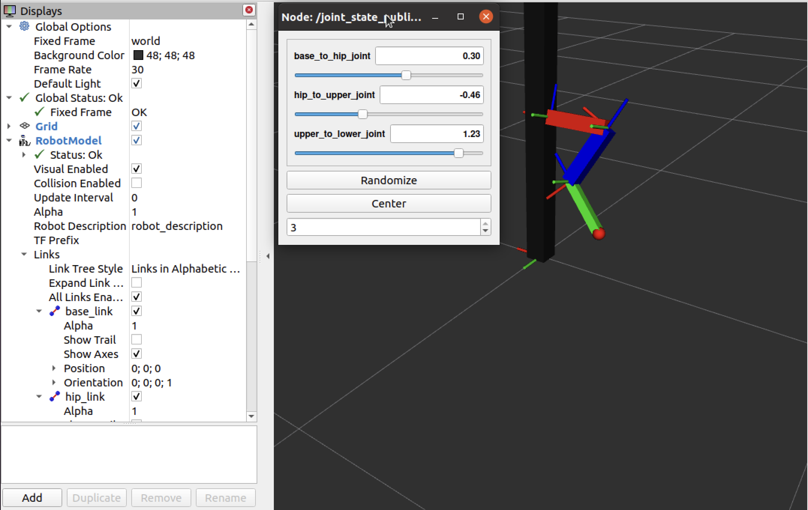
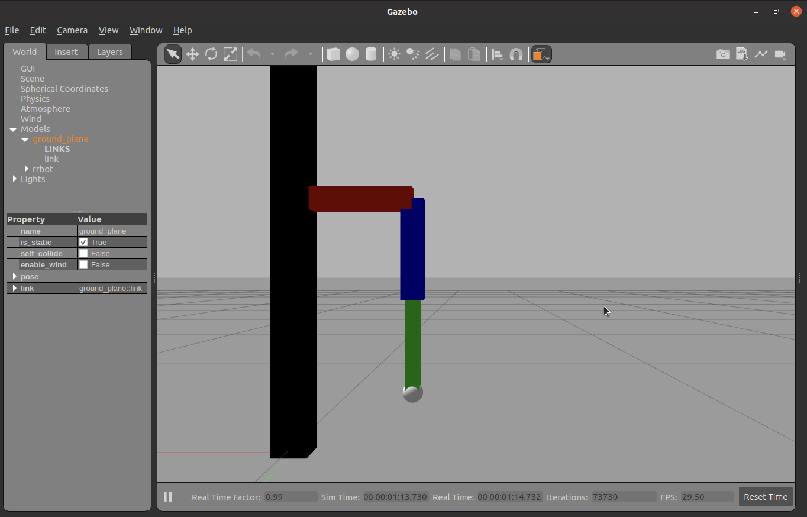

# 创建一个简单的机器人

>希望用一个简单的示例来巩固一些已有的知识。本示例旨在定义一个简单的三自由机械腿，该机械腿可以在`rviz`和`gazebo`中展示和进行简单控制（Joint Position Control）。本示例需用到以下知识：
>
>- 创建 ROS 项目
>- 创建 ROS 软件包
>- URDF（XACRO）文件的编写
>- Launch 文件的编写
>- rviz 和 gazebo 加载机器人
>- 发布简单的控制命令（主题发布订阅机制）
>
>本项目将该机械腿的名称定为`hello_leg`，项目名称定为`leg`

## 1 创建 ROS 项目

```shell
# Create the ros workspace
mkdir -p ~/catkin_ws/src
cd ~/catkin_ws/src
# Create a ros project
mkdir leg # the project name
```

## 2 创建 ROS 软件包

```shell
cd ~/catkin_ws/src/leg
# I like to create a folder (<robot_type>_simulator) to store all the robot description software packages, as a project may have multiple different robots.
mkdir leg_simulator && cd leg_simulator
catkin_create_pkg hello_leg_description # no depends
```

## 3 创建 URDF 文件

```shell
cd ~/catkin_ws/src/leg/leg_simulator/hello_leg_description
# Create urdf floder for storing URDF file.
mkdir urdf
# Create meshes floder for storing mesh file.
mkdir meshes # In this example, we dont need it.
```

将此 XACRO 文件[hello_leg.urdf.xacro]()复制到 urdf 文件夹下。

运行以下命令将 XACRO 文件转化为 URDF 文件：

```shell
xacro hello_leg.urdf.xacro > hello_leg.urdf
```

运行以下命令检查 URDF 文件：

```shell
check_urdf hello_leg.urdf
```

## 4 在 Rviz 中加载 URDF 文件

Rviz 可以用来进一步检查编写的机器人 URDF 文件的正确性，并进行修改调整。启动 rviz 需创建相应的 Launch 文件，命令如下：

```shell
cd ~/catkin_ws/src/leg/leg_simulator/hello_leg_description
# Create launch floder for storing Launch file.
mkdir launch
cd launch
touch rviz.launch
```

`rviz.launch` 文件内容如下：

```xml
<?xml version="1.0"?>
<launch>
	<param name="robot_description" textfile="$(find hello_leg_description)/urdf/hello_leg.urdf"/>
	<node name="joint_state_publisher_gui" pkg="joint_state_publisher_gui" type="joint_state_publisher_gui"/>
	<node name="robot_state_publisher" pkg="robot_state_publisher" type="robot_state_publisher"/>
	<node name="rviz" pkg="rviz" type="rviz" args="-d $(find hello_leg_description)/rviz/display.rviz"/>
</launch>
```

运行以下命令启动 rviz：

```shell
cd ~/catkin_ws/src
catkin_build
source devel/setup.bash
roslaunch hello_leg_description rviz.launch
```

启动上述`launch`文件打开`rviz`后，是没有机器人的，需要在添加`RobotModel`组件后才能显示机器人模型。然后，把此rviz文件另存为`~/catkin_ws/src/leg/leg_simulator/hello_leg_description/rviz/display.rviz`，即上述`launch`文件中第6行参数部分，以方便下次打开时不用重新添加`RobotModel`组件。

Rivz 显示结果如下：



## 5 在 Gazebo 中加载 URDF 文件

Gazebo 可以用来做机器人仿真（rviz 只能显示，无法模拟物理特性）， 启动 gazbeo 需创建相应的 Launch 文件，命令如下：

```shell
cd ~/catkin_ws/src/leg/leg_simulator/hello_leg_description/launch
touch gazebo.launch
```

`gazebo.launch` 文件内容如下：

```xml
<?xml version="1.0"?>
<launch>
    <!-- these are the arguments you can pass this launch file, for example paused:=true -->
    <arg name="paused" default="false"/>
    <arg name="use_sim_time" default="true"/>
    <arg name="gui" default="true"/>
    <arg name="headless" default="false"/>
    <arg name="debug" default="false"/>

    <!-- We resume the logic in empty_world.launch, changing only the name of the world to be launched -->
    <include file="$(find gazebo_ros)/launch/empty_world.launch">
        <arg name="debug" value="$(arg debug)" />
        <arg name="gui" value="$(arg gui)" />
        <arg name="paused" value="$(arg paused)"/>
        <arg name="use_sim_time" value="$(arg use_sim_time)"/>
        <arg name="headless" value="$(arg headless)"/>
    </include>

    <!-- Load the URDF into the ROS Parameter Server -->
    <param name="robot_description" textfile="$(find hello_leg_description)/urdf/hello_leg.urdf" />

    <!-- Run a python script to the send a service call to gazebo_ros to spawn a URDF robot -->
    <node name="urdf_spawner" pkg="gazebo_ros" type="spawn_model" respawn="false" output="screen"
        args="-urdf -model rrbot -param robot_description"/>
</launch>
```

运行以下命令启动 gazebo:

```shell
cd ~/catkin_ws/src
catkin_build
source devel/setup.bash
roslaunch hello_leg_description gazebo.launch
```

Gazebo 显示结果如下：



## 6 控制机器人

### 6.1 修改 URDF 文件

根据参考教程 [2] 知，需要在 URDF 文件中添加`gazebo_ros_control`插件和`<transmission>`标签，通常做法是新建一个`hello_leg.gazebo`专门存放这些信息，然后把它合并到`hello_leg.urdf`中，命令如下：

```shell
cd ~/catkin_ws/src/leg/leg_simulator/hello_leg_description/urdf
touch hello_leg.gazebo
```

将 [hello_leg.gazebo]() 的内容复制到 urdf 文件夹下，内容如下：

```xml
<?xml version="1.0"?>
<robot>
  <!-- ros_control plugin -->
  <gazebo>
    <plugin name="gazebo_ros_control" filename="libgazebo_ros_control.so">
      <robotNamespace>/hello_leg</robotNamespace>
      <robotSimType>gazebo_ros_control/DefaultRobotHWSim</robotSimType>
    </plugin>
  </gazebo>

  <!-- Base -->
  <gazebo reference="base_link">
    <material>Gazebo/Black</material>
  </gazebo>

  <!-- Hip -->
  <gazebo reference="hip_link">
    <material>Gazebo/Red</material>
  </gazebo>

  <!-- Upper -->
  <gazebo reference="upper_link">
    <material>Gazebo/Blue</material>
  </gazebo>

  <!-- Lower -->
  <gazebo reference="lower_link">
    <material>Gazebo/Green</material>
  </gazebo>
  
  <!-- Transmission -->
  <transmission name="base_to_hip_transmission">
    <type>transmission_interface/SimpleTransmission</type>
    <joint name="base_to_hip_joint">
      <hardwareInterface>hardware_interface/EffortJointInterface</hardwareInterface>
    </joint>
    <actuator name="base_to_hip_motor">
      <hardwareInterface>hardware_interface/EffortJointInterface</hardwareInterface>
      <mechanicalReduction>1</mechanicalReduction>
    </actuator>
  </transmission>

  <transmission name="hip_to_upper_transmission">
    <type>transmission_interface/SimpleTransmission</type>
    <joint name="hip_to_upper_joint">
      <hardwareInterface>hardware_interface/EffortJointInterface</hardwareInterface>
    </joint>
    <actuator name="hip_to_upper_motor">
      <hardwareInterface>hardware_interface/EffortJointInterface</hardwareInterface>
      <mechanicalReduction>1</mechanicalReduction>
    </actuator>
  </transmission>

  <transmission name="upper_to_lower_transmission">
    <type>transmission_interface/SimpleTransmission</type>
    <joint name="upper_to_lower_joint">
      <hardwareInterface>hardware_interface/EffortJointInterface</hardwareInterface>
    </joint>
    <actuator name="upper_to_lower_motor">
      <hardwareInterface>hardware_interface/EffortJointInterface</hardwareInterface>
      <mechanicalReduction>1</mechanicalReduction>
    </actuator>
  </transmission>
</robot>
```

修改 hello_leg.urdf.xacro 文件，在文件末尾添加此行代码：

```xml
<!-- Import all Gazebo-customization elements, including Gazebo colors -->
<xacro:include filename="$(find hello_leg_description)/urdf/hello_leg.gazebo"/>
```

运行以下命令将 XACRO 文件转化为 URDF 文件：

```shell
cd ~/catkin_ws/src
catkin build
source devel/setup.bash # for finding hello_leg_description package
xacro hello_leg.urdf.xacro > hello_leg.urdf
```

### 6.2 创建 ros_control 软件包

#### 6.2.1 创建新包

```shell
cd ~/catkin_ws/src/leg
catkin_create_pkg leg_controller
cd leg_controller
mkdir launch
mkdir config
```

#### 6.2.2 创建 .yaml 文件

在 leg_controller/config 文件夹下创建`hello_leg_control.yaml`文件，来包含 pid 参数和控制器设置这些待加载的参数。文件内容如下：

```yaml
hello_leg:
  # Publish all joint states -----------------------------------
  joint_state_controller:
    type: joint_state_controller/JointStateController
    publish_rate: 50  

  # Position Controllers ---------------------------------------
  base_to_hip_joint_position_controller:
    type: effort_controllers/JointPositionController
    joint: base_to_hip_joint
    pid: {p: 100.0, i: 0.01, d: 10.0}
  hip_to_upper_joint_position_controller:
    type: effort_controllers/JointPositionController
    joint: hip_to_upper_joint
    pid: {p: 100.0, i: 0.01, d: 10.0}
  upper_to_lower_joint_position_controller:
    type: effort_controllers/JointPositionController
    joint: upper_to_lower_joint
    pid: {p: 100.0, i: 0.01, d: 10.0}
    
```

#### 6.2.3 创建 Launch 文件

启动 ros_control 的 `controller.launch` 文件如下：

```xml
<?xml version="1.0"?>
<launch>
    <!-- Load joint controller configurations from YAML file to parameter server -->
    <rosparam file="$(find leg_controller)/config/hello_leg_control.yaml" command="load"/>

    <!-- load the controllers -->
    <node name="controller_spawner" 
          pkg="controller_manager" 
          type="spawner" 
          respawn="false"
          output="screen" 
          ns="/hello_leg" 
          args="base_to_hip_joint_position_controller 
                hip_to_upper_joint_position_controller 
                upper_to_lower_joint_position_controller
                joint_state_controller"/>
</launch>
```

### 6.3 启动 Gazebo 仿真和机器人控制器

```shell
cd ~/catkin_ws/src
catkin clean
catkin build
source devel/setup.bash
roslaunch hello_leg_description gazebo.launch
# New terminal
cd ~/catkin_ws/src
source devel/setup.bash
roslaunch leg_controller controller.launch
```

### 6.5 手动发送命令

可以用命令以下查看当前主题：

```shell
rostopic list
```

发布命令使关节`base_to_hip_joint`旋转 0.9 rad。

```shell
rostopic pub -1 /hello_leg/base_to_hip_joint_position_controller/command std_msgs/Float64 "data: 0.9"
```

### 6.6 使用 RQT 发送命令

## 参考

[1] [Create a Mobile Robot Model with ROS + URDF](https://medium.com/teamarimac/create-a-mobile-robot-model-with-ros-urdf-4dc46446db7f)

[2] [Gazebo tutorial: ROS Control](https://classic.gazebosim.org/tutorials?tut=ros_control&cat=connect_ros)
